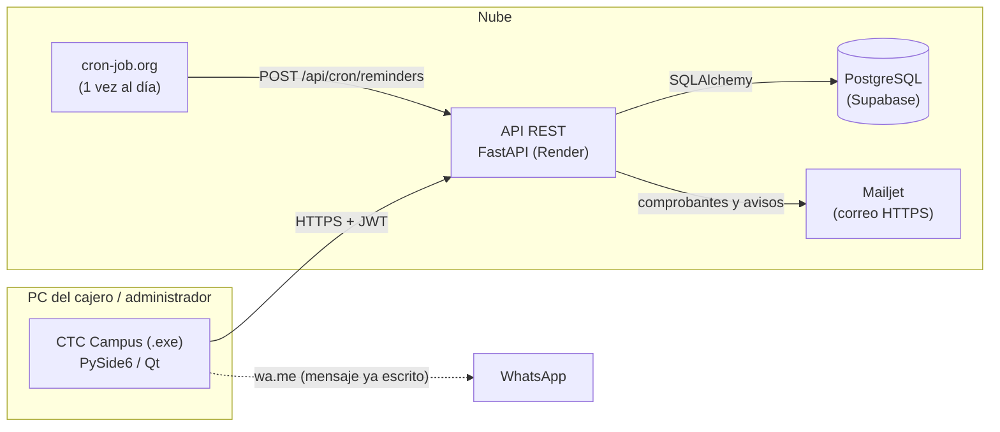
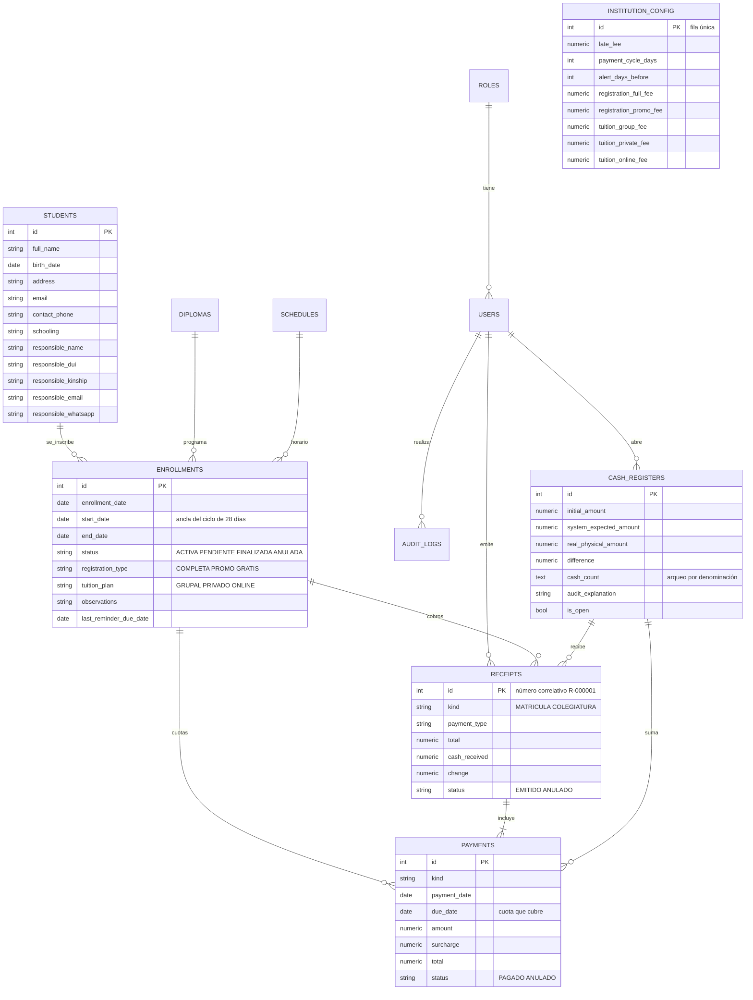

# Manual técnico — CTC Campus

Sistema de cobro de colegiaturas y matrículas de diplomados para CTC El
Salvador. Este documento describe la arquitectura, el modelo de datos, las
reglas de negocio, la API, la seguridad, las pruebas y el despliegue.

## 1. Arquitectura

| Capa | Carpeta | Responsabilidad |
| --- | --- | --- |
| Rutas | `backend/app/routes/` | HTTP, permisos por rol, validación de entrada (Pydantic) |
| Servicios | `backend/app/services/` | Reglas de negocio: cobro, cuotas, caja, comprobantes, bitácora, correo |
| Modelos | `backend/app/models/` | Tablas (SQLAlchemy) |
| Esquemas | `backend/app/schemas/` | Contratos de entrada/salida y validaciones |
| Núcleo | `backend/app/core/` | Tarifario, hora oficial, validadores, configuración |
| Migraciones | `backend/alembic/versions/` | Cambios de esquema versionados (se aplican al iniciar) |
| Escritorio | `desktop/` | Pantallas, reportes, tickets e impresión |

## 2. Modelo de datos

Todos los montos son `NUMERIC(10,2)` y en Python `Decimal`: nunca `float`,
para no acumular errores de redondeo en dinero auditado.

## 3. Reglas de negocio

1. **Ciclo de 28 días.** La cuota *k* (desde 0) vence `inicio + k × 28`.
   Ejemplo del PDF: inicio 01/08/2026 → 01/08/2026, 29/08/2026, 26/09/2026…
   (`PaymentService.due_date`).
2. **Número de cuotas.** `⌈(fin − inicio) / 28⌉`; el fin es el inicio más la
   duración del diplomado en meses. 6 meses = 7 cuotas. No se cobra de más.
3. **Estados.** `PENDIENTE` si la próxima cuota ya venció; `ACTIVA` si está al
   día; `FINALIZADA` si pagó todo y terminó el diplomado; `ANULADA` a mano.
   Se recalculan en cada consulta, en el hilo horario y en cada login.
4. **Recargo por mora.** $3.00 configurable, uno por cobro, opcional (casilla).
5. **Efectivo y cambio.** Con efectivo se exige `efectivo ≥ total` y el cambio
   es la diferencia; con tarjeta o transferencia se cobra el monto exacto.
6. **Caja.** Todo cobro exige una caja abierta de quien cobra (cajero o
   administrador). El arqueo compara solo el efectivo (fondo + cobros en
   efectivo) con lo contado; si hay diferencia, la justificación es obligatoria.
7. **Comprobantes.** Cada cobro genera un comprobante con número correlativo
   (secuencia de la base de datos: sin duplicados entre cajeros). Un cobro de
   varias cuotas es un solo comprobante.
8. **Anulación.** Un pago cobrado nunca se edita ni se borra: se anula el
   comprobante completo con motivo; las cuotas vuelven a deberse.
9. **Avisos.** 7 días antes del vencimiento se envía un correo al estudiante y a
   su responsable (una sola vez por vencimiento, `last_reminder_due_date`).
10. **Hora oficial.** Todas las fechas de negocio usan la hora de El Salvador
    (`app/core/clock.py`, UTC−6 sin horario de verano), no la del servidor.
11. **Atomicidad.** La matrícula (estudiante nuevo + inscripción + cobro +
    comprobante + bitácora) se guarda en una sola transacción.
12. **Concurrencia.** El cobro bloquea la fila de la matrícula
    (`SELECT … FOR UPDATE`) para que dos cobros simultáneos no dupliquen cuotas.

## 4. API (resumen)

La documentación interactiva completa está en `/docs` (Swagger).

| Recurso | Endpoints principales | Rol |
| --- | --- | --- |
| Autenticación | `POST /auth/login`, `POST /auth/change-password` | Todos |
| Estudiantes | `GET/POST /students/`, `PUT /students/{id}`, `DELETE` (admin) | Todos |
| Inscripciones | `POST /enrollments/` (formulario único), `GET`, `PUT` / `cancel` / `DELETE` (admin) | Todos / admin |
| Cobros | `POST /payments/collect`, `GET /payments/next/{id}`, `GET /payments/`, `POST /payments/{id}/void` (admin) | Todos / admin |
| Comprobantes | `GET /receipts/{id}`, `GET /payments/{id}/ticket` | Todos |
| Caja | `POST /cashier/register/open`, `GET /cashier/register/current`, `POST /cashier/register/close` | Quien cobra |
| Cierres | `GET /cashier/registers/{id}/report`, `GET /cashier/daily`, `GET /cashier/monthly`, `GET /cashier/registers` (admin) | Cada quien lo suyo; admin todo |
| Reportes | `GET /reports/upcoming-payments`, `GET /reports/student-history/{id}` | Todos |
| Configuración | `GET /config/`, `PUT /config/` (admin) | Todos / admin |
| Usuarios | `POST/GET /users/cashiers`, `PATCH`, `reset-password` | Admin |
| Bitácora | `GET /audit/` | Admin |
| Cron | `POST /api/cron/reminders` (encabezado `X-Cron-Secret`) | Servicio externo |

## 5. Seguridad

- Contraseñas con **bcrypt**; sesiones con **JWT** que expiran.
- Roles verificados en la API (no solo ocultos en el menú).
- Contraseñas temporales (seed, cajeros nuevos, restablecidas) obligan a
  cambiarse: la API responde 403 a todo lo demás mientras tanto.
- Bloqueo de 5 minutos tras 5 intentos fallidos, en memoria y en la cuenta
  (persiste aunque el servidor se reinicie).
- Bitácora de operaciones sensibles, solo de inserción.
- Validación estricta de datos: DUI con dígito verificador, teléfonos de El
  Salvador, nombres sin números, fechas posibles, edad mínima.
- Las credenciales viven en variables de entorno (`.env` fuera de git).

## 6. Pruebas

| Suite | Comando | Base de datos |
| --- | --- | --- |
| Backend (FastAPI) | `cd backend; ..\.venv\Scripts\python.exe -m pytest tests -q` | SQLite temporal (local) o PostgreSQL desechable (CI). **Nunca** la base real: `conftest.py` se niega a correr contra Supabase |
| Escritorio | `$env:QT_QPA_PLATFORM='offscreen'; .venv\Scripts\python.exe -m pytest desktop\tests -q` | Ninguna (datos de ejemplo) |

`backend/tests/test_propuesta_pdf.py` contiene una prueba por cada punto de la
propuesta (ver `docs/TRAZABILIDAD.md`). GitHub Actions (`.github/workflows/ci.yml`)
aplica las migraciones en PostgreSQL, siembra datos y corre ambas suites en cada push.

## 7. Despliegue

1. **Base de datos:** proyecto PostgreSQL en Supabase (cadena de conexión del pooler).
2. **API:** Render lee `render.yaml`; al iniciar ejecuta `alembic upgrade head`
   y luego `uvicorn`. Variables: `DATABASE_URL`, `SECRET_KEY`, `ALGORITHM`,
   `ACCESS_TOKEN_EXPIRE_MINUTES`, `MAILJET_API_KEY`, `MAILJET_API_SECRET`,
   `EMAIL_FROM_ADDRESS`, `CRON_SECRET`.
3. **Avisos diarios:** cron externo `POST /api/cron/reminders` con `X-Cron-Secret`.
4. **Escritorio:** `desktop\build_exe.ps1` genera `dist\CTC-Campus.zip`; editar
   `config.json` con la URL de la API.
5. **Respaldo:** antes de aplicar una migración nueva en producción, sacar un
   respaldo desde Supabase (*Database → Backups*).

### Migración `c1d2e3f4a5b6` (comprobantes, bitácora y tarifario)

Crea `receipts` y `audit_logs`; agrega a `payments` el comprobante y la caja
(asignando los pagos existentes a la caja que su cajero tenía abierta en ese
momento); agrega el tarifario a `institution_config`, la contraseña temporal
y el bloqueo a `users`, y el arqueo a `cash_registers`. **Elimina** las columnas
sin uso `diplomas.registration_fee`, `diplomas.monthly_fee` y `students.dui`.
Probada hacia arriba y hacia abajo sobre una copia con datos de ejemplo.
